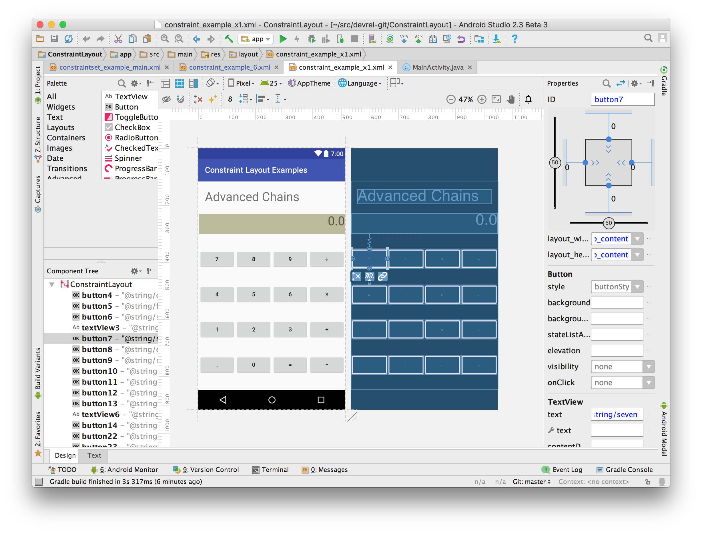

Constraint Layout Samples
=========================
This repository contains a list of layouts that showcases the various features and usage of
[ConstraintLayout](https://developer.android.com/reference/android/support/constraint/ConstraintLayout.html)

Pre-requisites
--------------
- Android Studio 2.3
- Constaint Layout library 1.0.1

Getting Started
---------------
Import the project using Android Studio. Navigate to the app>res>layout> and open one of the layouts
in the layout editor. This sample is best understood by seeing the constraints in the Design mode
of the layout editor.

Screenshots
------------

Support
-------
If you've found an error in this sample, please file an issue:
https://github.com/googlesamples/android-ConstraintLayoutExamples/issues

To learn more about ConstraintLayout checkout the
[Constraint Layout Training Guide](https://developer.android.com/training/constraint-layout/index.html)

Patches are encouraged, and may be submitted by forking this project and
submitting a pull request through GitHub. Please see CONTRIBUTING.md for more details.

License
-------

Copyright 2017 The Android Open Source Project, Inc.

Licensed to the Apache Software Foundation (ASF) under one or more contributor
license agreements.  See the NOTICE file distributed with this work for
additional information regarding copyright ownership.  The ASF licenses this
file to you under the Apache License, Version 2.0 (the "License"); you may not
use this file except in compliance with the License.  You may obtain a copy of
the License at

  http://www.apache.org/licenses/LICENSE-2.0

Unless required by applicable law or agreed to in writing, software
distributed under the License is distributed on an "AS IS" BASIS, WITHOUT
WARRANTIES OR CONDITIONS OF ANY KIND, either express or implied.  See the
License for the specific language governing permissions and limitations under
the License.
